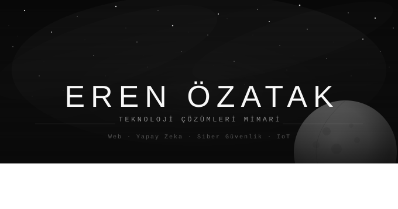

# Eren Özatak

### AI Automation · Python Tooling · DevOps-Fluent Product Builder

Building automation systems, internal tools, lean web products, and practical AI integrations for real business workflows.

---

## About Me

I'm a Management Information Systems graduate and the builder behind **ErSeLabs**.

My strongest work sits at the intersection of:
- **AI automation**
- **Python-based internal tools**
- **Linux / VPS / deployment operations**
- **workflow systems for SMBs and service businesses**
- **practical prototypes that move quickly from idea to usable product**

I enjoy turning messy manual processes into reliable systems — from dashboards and automations to lightweight developer tools and deployment workflows.

> Currently focused on **remote-friendly engineering work** involving automation, product tooling, AI integrations, and technical operations.

---

## What I Build

### 1) AI Automation Systems
Tools and pipelines that combine LLMs, bots, APIs, and operational workflows.

### 2) Internal Tools & Utilities
Small but useful products that solve real problems: repo tooling, scanners, indexing tools, reporting utilities, and workflow helpers.

### 3) Deployment & Ops-Friendly Products
Projects that are not just coded, but also packaged, deployed, monitored, and operated in real environments.

---

## Featured Projects

| Project | What it does | Stack |
|---|---|---|
| [repo-scribe](https://github.com/Eren-Oztk/repo-scribe) | Generates and updates GitHub repo descriptions and topics with AI. | Python, GitHub API, LLM APIs |
| [vps-scanner](https://github.com/Eren-Oztk/vps-scanner) | Scans a VPS and Docker setup to generate a masked infrastructure report. | Bash, Linux, Docker |
| [yerli-dali-ai-studio](https://github.com/Eren-Oztk/yerli-dali-ai-studio) | AI image upscaling and enhancement workflow with UI and Telegram integration. | Python, Gradio, Real-ESRGAN |
| [Esp32_Wifi_Keyboard](https://github.com/Eren-Oztk/Esp32_Wifi_Keyboard) | Sends browser text to an ESP32-connected OLED display over local Wi-Fi. | ESP32, Arduino, HTML |
| [Kod_Tarama](https://github.com/Eren-Oztk/codebase-map) | Scans disks for code files and groups projects into a readable HTML report. | Python, HTML reporting |
| [Otomotik-SS-Alma](https://github.com/Eren-Oztk/multi-monitor-screenshot-tool) | Lightweight screenshot utility for multi-monitor setups. | Python, desktop tooling |

---

## Core Stack

### Languages & Frameworks

### AI & Automation

### Infra & Operations

### IoT & Embedded

---

## Work Style

- I like **shipping useful things fast**.
- I care about **real-world utility**, not only demos.
- I am strongest in **builder/generalist** environments where product, automation, and ops overlap.
- I work best on projects that need someone to both **build** and **make the system run reliably**.

---

## GitHub Stats

  
  

   
  

---

## Contact

- Website: [erenozatak.com.tr](https://erenozatak.com.tr)
- LinkedIn: [eren-özatak](https://www.linkedin.com/in/eren-özatak-579b4b18a)
- Telegram: [@ErenOzatak](https://t.me/ErenOzatak)
- Company: [ErSeLabs](https://erselabs.com.tr)

---

*Building practical systems with AI, automation, and infrastructure in the loop.*

